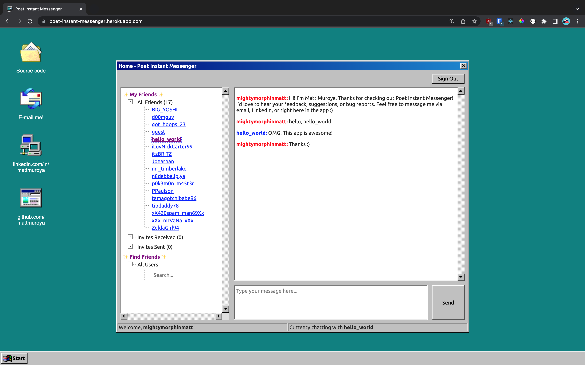
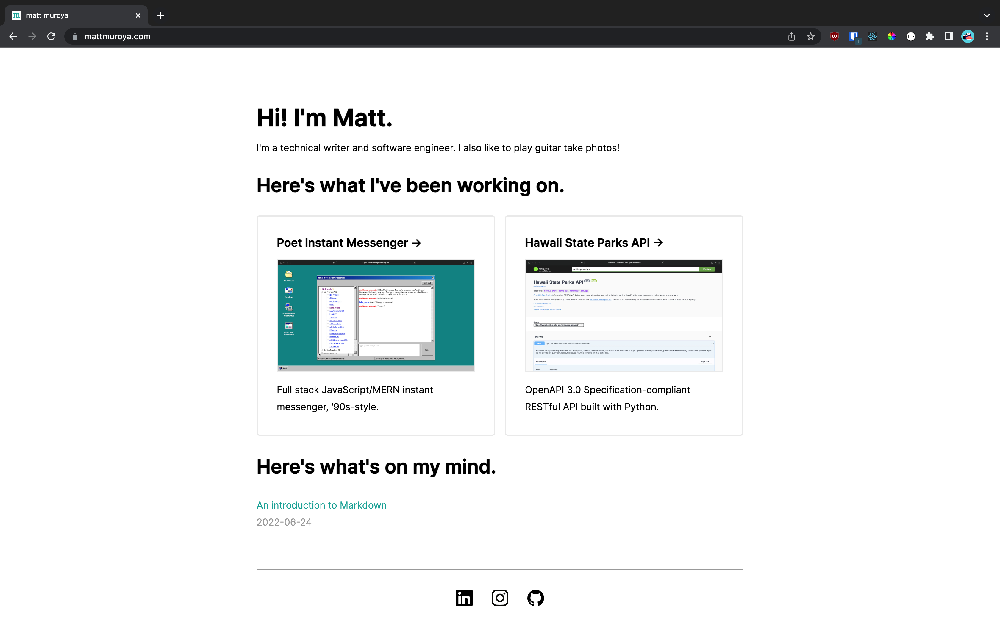
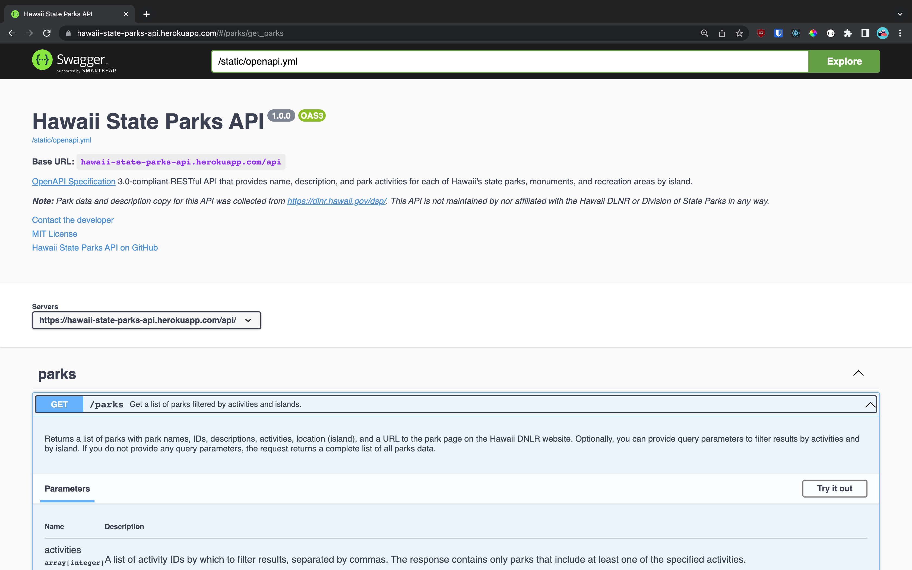
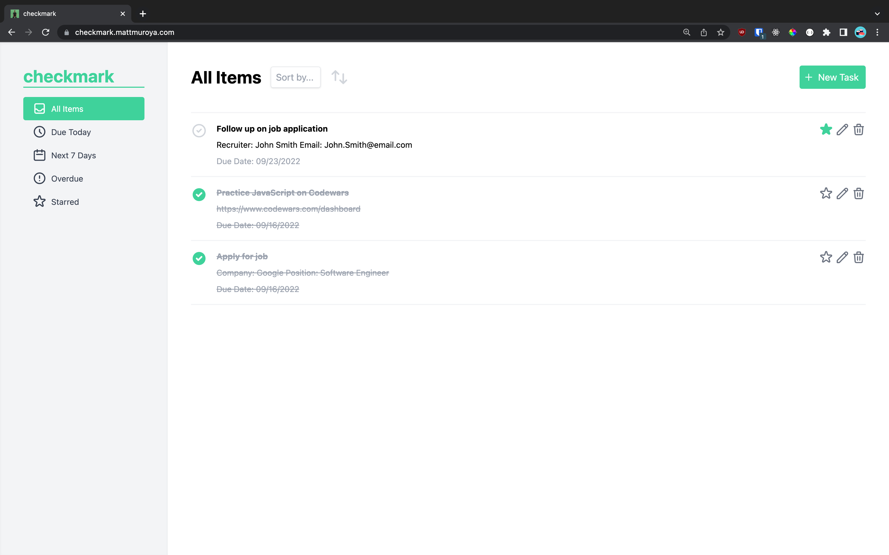
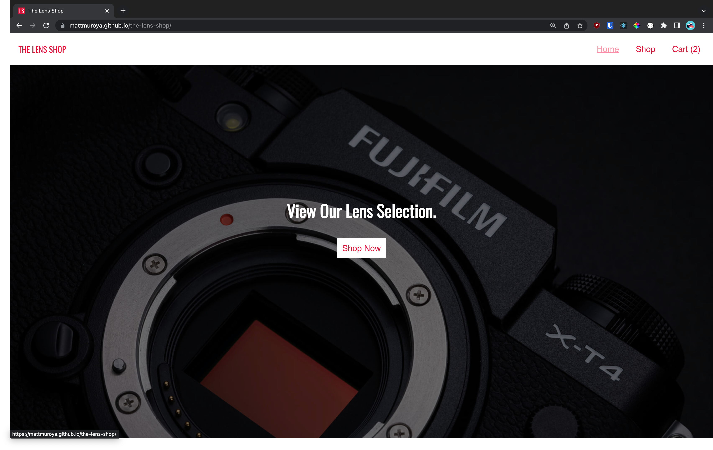
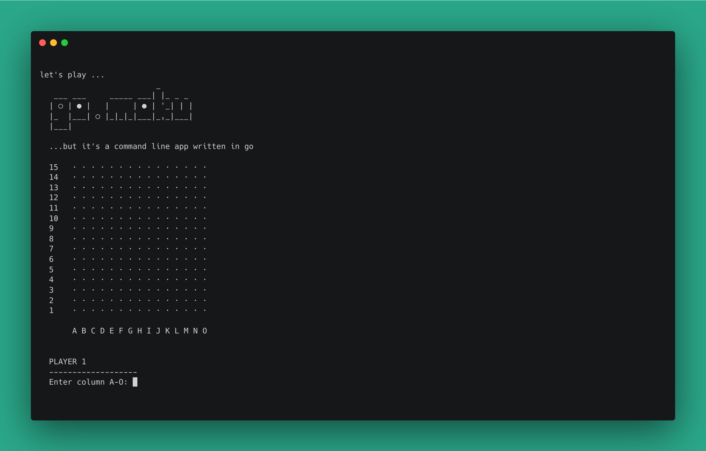

<h1 align="center">✨ Hi, I'm Matt! ✨</h1>

  
I'm a technical writer and software developer currently located in Honolulu, HI 🌈

  
  

  <h2>Here's what I've been working on!</h2>

  <table>
    <tr valign="top">
      <td width="50%">
        
        <h3>Poet Instant Messenger</h3>
        
Full stack React/Node.js chat application in the spirit of the classic IM apps of the late '90s.

        

          <a href="https://github.com/mattmuroya/poet">GitHub</a> | <a href="https://poet-instant-messenger.herokuapp.com/">Demo</a>
        

      </td>
      <td width="50%">
        
        <h3>mattmuroya.com</h3>
        
Routes and content statically generated from Markdown files using React/Next.js

        

          <a href="https://github.com/mattmuroya/poet">GitHub</a> | <a href="https://poet-instant-messenger.herokuapp.com/">Demo</a>
        

      </td>
    </tr>
    <tr valign="top">
      <td width="50%">
        
        <h3>Hawaii State Parks API</h3>
        
Python/Flask REST API providing descriptions and park data for each of Hawaii's state parks.

        

          <a href="https://github.com/mattmuroya/hawaii-state-parks-api">GitHub</a> | <a href="https://hawaii-state-parks-api.herokuapp.com/">Demo</a>
        

      </td>
      <td width="50%">
        
        <h3>Checkmark</h3>
        
Fully responsive vanilla JavaScript task manager demonstrating basic OOP design principles.

        

          <a href="https://github.com/mattmuroya/checkmark">GitHub</a> | <a href="https://checkmark.mattmuroya.com/">Demo</a>
        

      </td>
    </tr>
    <tr valign="top">
      <td width="50%">
        
        <h3>The Lens Shop</h3>
        
Mock storefront/shopping cart demonstrating state management with React.

        

          <a href="https://github.com/mattmuroya/the-lens-shop">GitHub</a> | <a href="https://mattmuroya.github.io/the-lens-shop/">Demo</a>
        

      </td>
      <td width="50%">
        
        <h3>go.moku</h3>
        
Gomoku, but it's a command line game written in Go. AI opponent coming soon!

        

          <a href="https://github.com/mattmuroya/go.moku">GitHub</a>
        

      </td>
    </tr>
  </table>  

